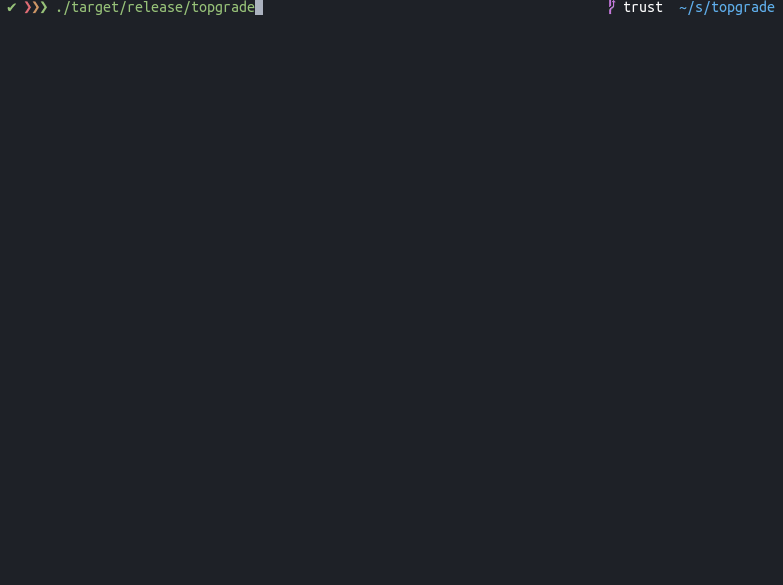

# Topgrade

Keeping your system up to date mostly involves invoking more than a single package manager. This
usually results in big shell one-liners saved in your shell history. Topgrades tries to solve this
problem by detecting which tools you use and invoke their appropriate package managers.

## Installation
You can either use `cargo install` or use the compiled binaries from the release page.

## Usage
Just invoke `topgrade`. It will invoke the following steps:

* Check if the following paths are tracked by Git. If so, pull them:
  * ~/.emacs.d (Should work whether you use [Spacemacs](http://spacemacs.org/) or a custom configuration)
  * ~/.zshrc
  * [~/.oh-my-zsh](https://github.com/robbyrussell/oh-my-zsh)
  * ~/.tmux

* *Unix*: Invoke [zplug](https://github.com/zplug/zplug) update
* *Unix*: Upgrade tmux plugins with [TPM](https://github.com/tmux-plugins/tpm)
* Invoke Cargo [install-update](https://github.com/nabijaczleweli/cargo-update)
* Upgrade Emacs packages
* *Linux*: Invoke the system package manager:
  * *Arch*: Invoke [yay](https://github.com/Jguer/yay) or fall back to pacman
  * *Redhat based*: Invoke `yum upgrade`
  * *Debian based*: Invoke `apt update && apt dist-upgrade`
* *Linux*: Run [needrestart](https://github.com/liske/needrestart)
* *macOS*: Upgrade [Homebrew](https://brew.sh/) packages
* *macOS*: Upgrade App Store applications
